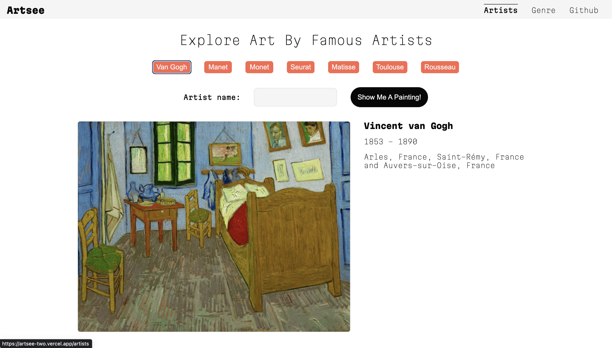
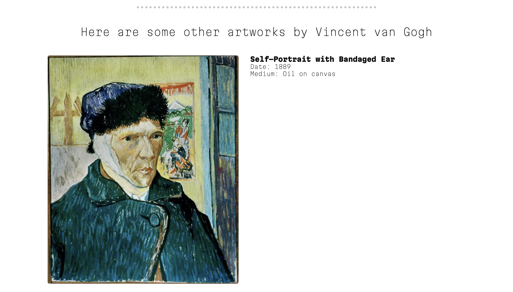
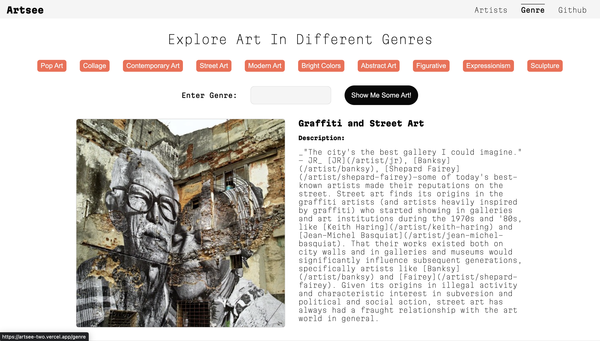
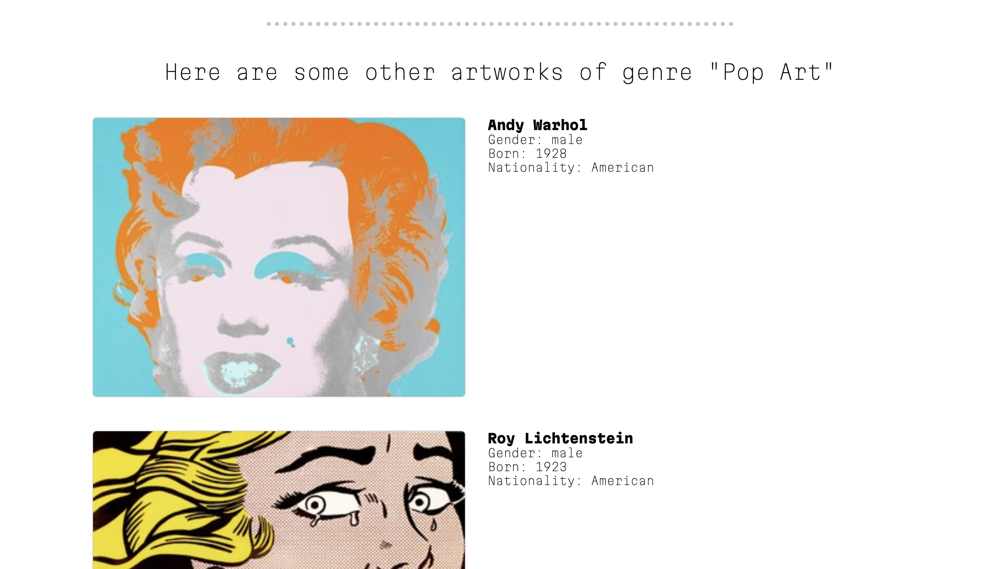

# Artsee

Artsee is a NextJS app that uses Artsy's API to explore art by famous artists. It is live and deployed on Vercel [here](https://artsee-two.vercel.app/).

## Final Product

1. Home Page 

2. Explore art by famous artists


3. Explore more art by the same artist


4. Explore art from a particular Genre


5. Explore more art by other artists of that same genre


## Getting Started
1. Fork it, clone it on your machine and `cd artsee`

2. Then install all dependencies.

```bash
npm install
```

3. Get an API token for using Artsy's API [here](https://developers.artsy.net/)

4. Add that token to your .env file. Also, have a .gitignore file to prevent all kinds of nonsense from getting committed.

5. Now, run the development server:

```bash
npm run dev

```

6. Open [http://localhost:3000](http://localhost:3000) with your browser to see the result.

Woohoo! 😀😀
